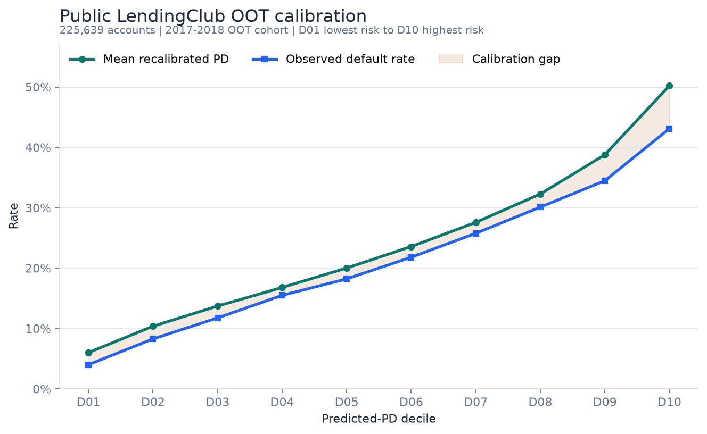
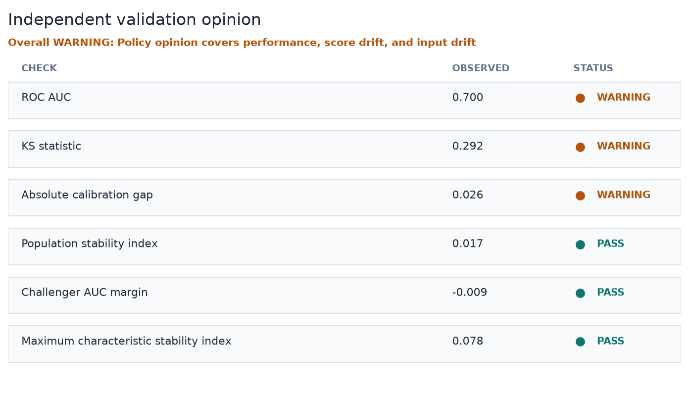
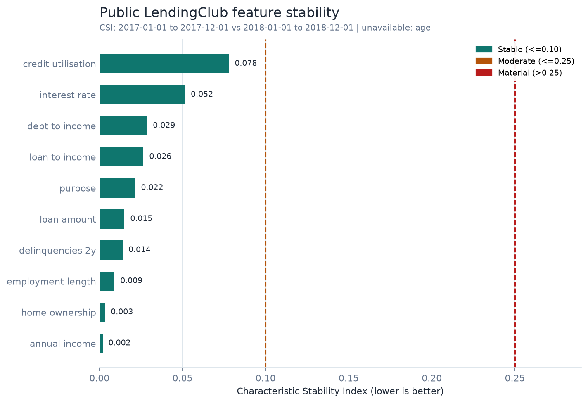
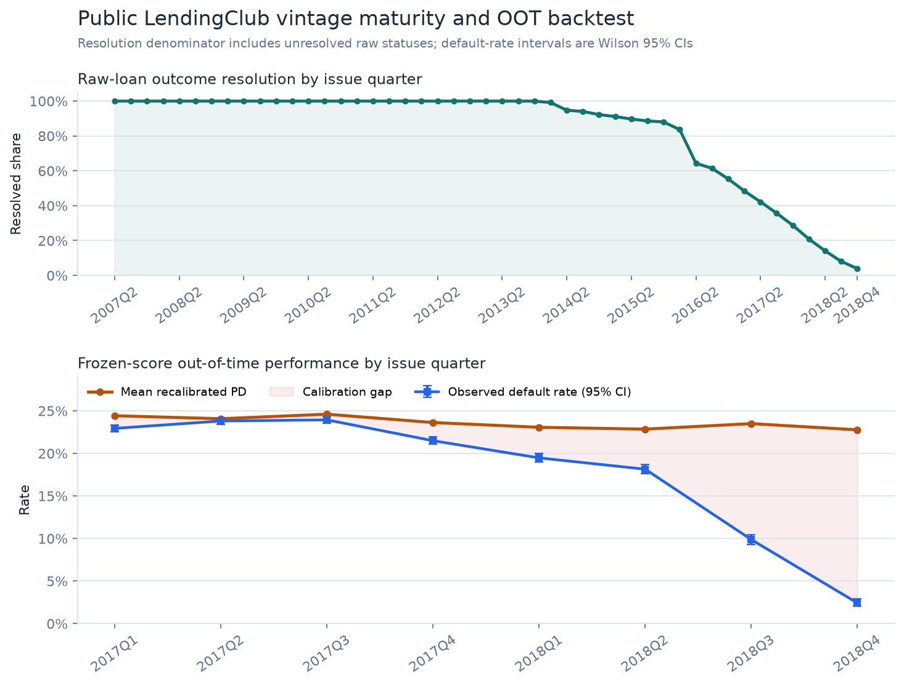
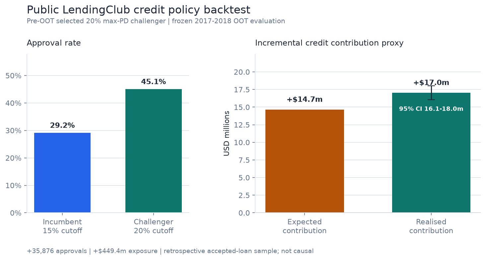
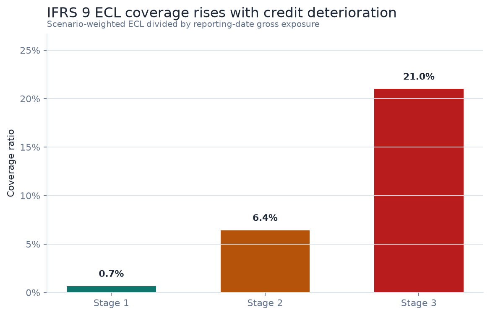
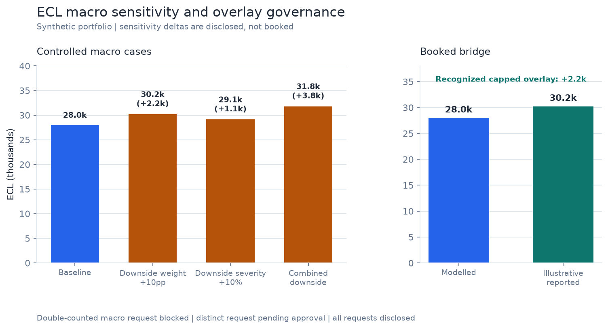

# Risk Analytics Portfolio

[](https://github.com/sheenwinkle/risk-analytics-portfolio/actions/workflows/python-tests.yml)


I combine economics, computer science, FRM-aligned risk knowledge, Python, PostgreSQL, and
machine learning to build auditable credit-risk workflows. This repository follows one
connected model lifecycle rather than presenting unrelated notebooks:

```text
Public/synthetic lending data
-> PD development and OOT scoring
-> vintage maturity and statistical uncertainty checks
-> IFRS 9 ECL consumption
-> independent validation opinion
-> score and input characteristic stability
-> calibration remediation and finding lifecycle
-> PostgreSQL governance evidence
```

## Evidence at a Glance

The public-data run processes the complete accepted-loans file from the
[All Lending Club loan data](https://www.kaggle.com/datasets/wordsforthewise/lending-club)
dataset. Raw and borrower-level files remain local; only aggregate evidence is committed.

| Evidence | Result |
| --- | ---: |
| Raw rows read | 2,260,701 |
| Resolved terminal-outcome rows | 1,348,099 |
| 2017-2018 OOT accounts | 225,639 |
| Selected-model OOT ROC-AUC / Gini / KS | 0.700 / 0.400 / 0.292 |
| Raw to recalibrated Brier score | 0.208 -> 0.155 |
| Selected-model ROC-AUC 95% CI | 0.697 -> 0.702 |
| Raw status resolution, 2017Q1 -> 2018Q4 | 48.4% -> 3.9% |
| Maximum available feature CSI | 0.077926 (credit utilisation) |
| Public independent validation opinion | warning |
| Synthetic stress-case validation opinion | fail |
| Sequential remediation calibration gap | 0.064 -> 0.009 |









## Connected Projects

| Project | Status | Main evidence | Target roles |
| --- | --- | --- | --- |
| [Credit Risk PD Modelling](projects/credit-risk-pd-model) | Complete case study | Full public-data run, temporal model selection, recalibration, champion-challenger strategy, WOE/IV, explainability, PSI | Credit Risk, Risk Analytics, Lending Data Science |
| [IFRS 9 ECL Engine](projects/ifrs9-ecl-engine) | Complete scoped case study | Staging, monthly PD/LGD/EAD, scenarios, migration, PD bridge, macro sensitivity, overlay controls | ECL, Portfolio Risk, Credit Risk |
| [Model Validation Framework](projects/model-validation-framework) | Complete scoped case study | Independent candidate rebuild, metrics, confidence intervals, vintage/segment backtesting, PSI/CSI drift, policy opinion, remediation lifecycle | Model Risk, Validation, Quant Risk |

## Project 1: Credit Risk PD Modelling

The workflow keeps model selection and calibration before untouched OOT evaluation:

```text
Chunked LendingClub ingestion and audit
-> origination-time feature controls
-> temporal development/calibration/OOT split
-> logistic baseline and random-forest challenger
-> pre-OOT model selection and logistic recalibration
-> OOT discrimination, calibration, strategy, WOE/IV, importance, and PSI evidence
```

The public-data model selected the random forest on the 2016 pre-OOT holdout. On the
2017-2018 OOT cohort, recalibration preserved ROC-AUC `0.699887` while reducing Brier score
from `0.208470` to `0.154725`. The highest-risk decile remained over-predicted by `7.1%`, so
the report retains a material calibration discussion rather than presenting a perfect model.

Public aggregate evidence:

- [Public run summary](projects/credit-risk-pd-model/reports/public_lendingclub/README.md)
- [Model report](projects/credit-risk-pd-model/reports/public_lendingclub/model_report.md)
- [Data lineage and SHA-256](projects/credit-risk-pd-model/reports/public_lendingclub/data_lineage.json)
- [Ingestion audit](projects/credit-risk-pd-model/reports/public_lendingclub/ingestion_audit.csv)
- [Raw-status vintage maturity](projects/credit-risk-pd-model/reports/public_lendingclub/vintage_resolution.csv)

The committed synthetic run remains the fast, deterministic CI fixture for cross-project
tests. It intentionally includes a stressed 2022 OOT period.

The strategy layer selects a controlled 20% max-PD growth challenger on pre-OOT evidence and
freezes it before evaluation. On public OOT data it adds 35,876 approvals and a USD 17.0 million
realised credit-contribution proxy uplift (95% paired-bootstrap interval: 16.1-18.0 million).
On the synthetic stress OOT, the same change adds 107 approvals but reduces realised
contribution by 0.14 million currency units (95% interval: -0.28m to -0.01m), so the governance decision
retains the incumbent. These are retrospective accepted-loan backtests, not causal A/B tests.



## Project 2: IFRS 9 ECL Engine

Project 2 consumes frozen Project 1 recalibrated PDs through a validated adapter without
using future outcomes to construct ECL inputs:

```text
Reporting-date PD cohort
-> explicit account assumptions and SICR/default flags
-> monthly base/upside/downside PD, LGD, and EAD paths
-> Stage 1 12-month ECL / Stage 2-3 lifetime ECL
-> discounting, scenario weighting, migration, and portfolio evidence
-> separate macro sensitivity, overlay controls, and ECL reconciliation
```





The implementation is deliberately transparent. It demonstrates staging, term structures,
discounting, scenario weighting, coverage ratios, and stage migration without claiming full
institution-specific IFRS 9 compliance.

The governance layer keeps sensitivity analysis separate from booked adjustments. On the
synthetic portfolio, a combined downside weight/severity case increases ECL by `13.56%` but
is not booked. One triggered, approved, non-overlapping overlay is capped at 8% of modelled
ECL, while a duplicate macro-risk request and a pending request remain unrecognized. The
auditable bridge reconciles `27,996.92` modelled ECL to `30,236.67` illustrative reported ECL.

Evidence: [macro sensitivity and overlay report](projects/ifrs9-ecl-engine/reports/macro_overlay/macro_overlay_report.md).

## Project 3: Model Validation and Remediation

Project 3 consumes the frozen score, outcome, and full model-input contract. It independently
reconciles the derived loan-to-income feature and reperforms AUC, Gini, tie-safe KS, Brier
score, calibration, monthly and quarterly monitoring, PSI, feature-level CSI, challenger
tests, and 95% confidence intervals without importing development code.

It also rebuilds the logistic baseline and random-forest challenger from a governed pre-OOT
extract. Both synthetic holdout AUCs reproduce exactly, model selection is unchanged, and all
19 transformed coefficients/importances per candidate reconcile within `1e-8`.

The public LendingClub model receives an overall **warning**: AUC, KS, and calibration are
near or within warning thresholds, while score PSI, feature CSI, and challenger checks pass.
Maximum available CSI is `0.077926` for `credit_utilisation`; unavailable borrower age is
reported explicitly rather than silently imputed. The synthetic stress candidate receives
**fail** for material PD underestimation.

The public AUC is `0.699887` with a DeLong 95% interval of `0.697369-0.702405`.
Quarterly results also expose outcome immaturity: raw status resolution declines from `48.4%`
in 2017Q1 to `3.9%` in 2018Q4, so the latest terminal-outcome default rates are not treated as
comparable mature-vintage estimates. Segment intervals distinguish material calibration
signals from small-sample noise; for example, `small_business` PD is under-predicted while a
two-row `wedding` segment is explicitly marked `limited_sample`.

For the synthetic calibration finding, each monthly retest uses a recalibrator fitted only on
the prior three matured monthly cohorts. Sequential retesting reduces the second-half
calibration gap from `0.064` to `0.009`, but the finding remains `pending_fresh_oot` because
six months of retesting are not enough for formal cross-cycle closure.

Evidence:

- [Public validation summary](projects/model-validation-framework/reports/public_lendingclub/README.md)
- [Synthetic validation report](projects/model-validation-framework/reports/validation_report.md)
- [Independent model replication](projects/model-validation-framework/reports/replication/model_replication_report.md)
- [Remediation and lifecycle report](projects/model-validation-framework/reports/remediation/remediation_report.md)
- [PostgreSQL schema](projects/model-validation-framework/sql/schema.sql)

## One-Command Reproduction

Create one root environment, run all tests and pipelines, and verify committed demo reports:

```powershell
powershell -ExecutionPolicy Bypass -File scripts/setup_and_run.ps1 `
  -WithTests `
  -VerifyCommitted
```

Download and rebuild the full public LendingClub evidence chain:

```powershell
powershell -ExecutionPolicy Bypass -File scripts/run_public_lendingclub.ps1
```

The public command downloads approximately 374 MB, processes the raw file in bounded-memory
chunks, fits the full model workflow, publishes aggregate-only Project 1 and Project 3
evidence, and rebuilds showcase charts. Raw data, processed borrower records, predictions,
and model binaries are Git-ignored.

VS Code exposes both commands through **Tasks: Run Task**:

- `Portfolio: Full Self-Test and Reproduction`
- `Portfolio: Reproduce Committed Evidence`
- `Build Public LendingClub Evidence`

## Engineering Controls

- Python packages with explicit public APIs rather than notebook-only logic
- Behavioural, edge-case, lineage, privacy, and deterministic-report tests
- Pre-OOT strategy selection, frozen OOT evaluation, and paired marginal-cohort uncertainty
- Separate ECL sensitivity, overlay trigger, double-counting, approval, cap, and reconciliation controls
- GitHub Actions matrix across all three projects
- CI PostgreSQL 16 integration test for run, metric uncertainty, grouped performance,
  characteristic drift, finding, benchmark, limitation, and remediation-event persistence
- Full-portfolio regeneration check with line-ending normalisation and machine-precision
  tolerance for parallel model output
- Borrower-level publication deny-list plus safe aggregate report lists
- Git-ignored development extracts with committed aggregate-only replication evidence
- PostgreSQL schema and analytical queries for validation governance history

## Repository Layout

```text
risk-analytics-portfolio/
  .github/workflows/
  .vscode/
  docs/assets/
  scripts/
  projects/
    credit-risk-pd-model/
      data/ reports/ scripts/ sql/ src/ tests/
    ifrs9-ecl-engine/
      data/ reports/ scripts/ sql/ src/ tests/
    model-validation-framework/
      data/ reports/ scripts/ sql/ src/ tests/
```

## Material Limitations

- LendingClub outcomes are resolved terminal-status proxies, not contractual fixed-horizon
  Basel or IFRS 9 default labels. Published vintage denominators quantify severe recent-cohort
  right-censoring but cannot remove it.
- Accepted-loan data does not represent all applicants and cannot support reject inference.
- The ECL engine's overlay records are synthetic governance examples; it still omits
  institution-specific accounting policy, contractual cash-flow, collateral, cure,
  macroeconomic model estimation, expert-judgement evidence, and production disclosure.
- Validation policy thresholds are explicit case-study assumptions, not regulatory cutoffs.
- Public aggregate results demonstrate analytical workflow, not production approval.

## Resume Positioning

> Built an end-to-end Python and PostgreSQL credit-risk portfolio across 2.26 million public
> LendingClub records, covering temporal PD development, recalibration, credit strategy,
> vintage maturity, IFRS 9 ECL consumption, macro sensitivity and overlay governance,
> independent candidate re-estimation, validation with confidence
> intervals and segment backtesting, score/feature drift, no-look-ahead remediation, and
> PostgreSQL governance persistence.

Detailed resume bullets and interview prompts are in
[docs/resume-project-description.md](docs/resume-project-description.md). Development setup
and the optional VS Code/Codex iteration process are documented in
[docs/vscode-codex-iteration.md](docs/vscode-codex-iteration.md).

## Next Evidence

- Add documented SICR rebuttal decisions and contractual cash-flow sensitivity.
- Revisit the pending calibration finding when an additional matured OOT horizon is available.
